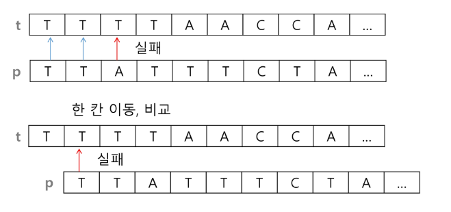
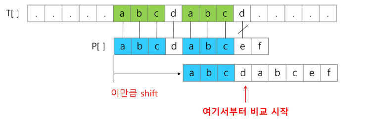
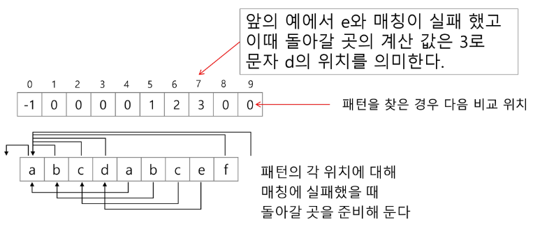
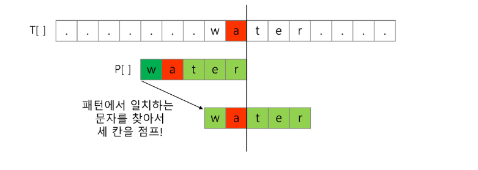
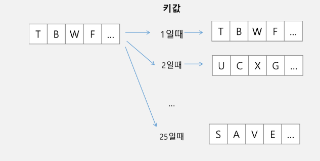

# String
## 패턴 매칭
- 패턴 매칭에 사용되는 알고리즘들
    - 고지식한 패터 검색 알고리즘
    - 카프-라빈 알고리즘
    - KMP 알고리즘
    - 보이어-무어 알고리즘

### 고지식한 알고리즘 (Brute Force)
- 본문 문자열을 처음부터 끝까지 차례대로 순회하면서 패턴 내의 문자들을 일일이 비교하는 방식으로 동작

- 알고리즘
```python
p = "is"                    # 찾을 패턴
t = "This bok is a book~!"  # 전체 텍스트
M = len(p)                  # 찾을 패턴의 길이
N = len(t)                  # 전체 텍스트의 길이

def BruteForce(p, t):
    i = 0                   # t의 인덱스
    j = 0                   # p의 인덱스
    while j < M and i < N:
        if t[i] != p[i]:
            i = i - j
            j = -1
        i = i + 1
        j = j + 1
    if j == M:
        return i - M        # 검색 성공
    else:
        return -1           # 검색 실패
```
- 고지식한 패턴 검색 알고리즘의 시간 복잡도
    - 최악의 경우 시간 복잡도는 텍스트의 모든 위치에서 패턴을 비교해야 하므로  O(MN)이 됨
    - 길이가 10000인 문자열에서 길이 80인 패턴을 찾는다고 할 때, 최악의 경우 약 10000 * 80 = 800000번의 비교가 일어남
    - 비교횟수를 줄일 수 있는 방법은 없는가?

### KMP 알고리즘
- 불일치가 발생한 텍스트 스트링의 앞 부분에 어떤 문자가 있는지를 미리 알고 있으므로, 불일치가 발생한 앞 부분에 대하여 다시 비교하지 않고 매칭을 수행
- 패턴을 전처리하여 배열 next[M] 을 구해서 잘못된 시작을 최소화함
    - next[M]: 불일치가 발생했을 경우 이동할 다음 위치
- 시간 복잡도: O(M + N)
- 아이디어 설명
    - 덱스트에서 abcdabc까지는 매치되고, e에서 실패한 상황 패턴의 맨 앞의 abc와 실패 직전의 abc는 동일함을 이용하 수 있음
    - 실패한 텍스트를 문자와 P[4]를 비교
    
    - 매칭이 실패했을 때 돌아갈 곳을 계산
    

### 보이어 무어 알고리즘
- 오른쪽에서 왼쪽으로 비교
- 대부분의 상용 소프트웨어에서 채택하고 있는 알고리즘
- 보이어-무어 알고리즘은 패턴에 오른쪽 끝에 있는 문자가 불일치하고 이 문자가 패턴 내에 존재하지 않는 경우, 이동 거리는 무려 패턴의 길이 만큼이 됨

- 오른쪽 끝에 있는 문자가 불일치하고 이 문자가 패턴 내에 존재할 경우

- 보이어 무어 알고리즘을 이용한 예

- 문자열 매칭 알고리즘 비교
    - 찾고자 하는 문자열 패턴의 길이 m, 총 문자열 길이 n
    - 고지식한 패턴 검색 알고리즘: 수행시간 O(mn)
    - 카프-라빈 알고리즘: 수행시간 theta(n)
    - KMP 알고리즘: 수행시간 theta(n)
- 보이어 무어 알고리즘
    - 앞의 두 매칭 알고리즘들의 공통점 텍스트 문자열의 문자를 적어도 한번씩 훑는다는 것임. 따라서 최선의 경우에도 Omega(n)
    - 보이어-무어 알고리즘은 텍스트 문자를 다 보지 않아도 됨
    - 발상의 전환: 패턴의 오른쪽부터 비교
    - 최악의 경우 수행시간: theta(mn)
    - 입력에 따라 다르지만 일반적으로 theta(n) 보다 시간이 덜 듬

### 문자열 암호화
#### 시저 암호(Caesar cipher)
- 줄리어스 시저가 사용했다고 하는 암호
- 시저는 기원전 100년경에 로마에서 활약했던 장군이었음
- 시저 암호에서는 평문에서 사용되고 있는 알파벳을 일정한 문자 수 만큼 평행이동 시킴으로써 암호화를 행함
- 1만큼 평행했을 때 1을 키값이라 함
- 시저 암호문에 대한 전사공격

- 문자 변환표를 이용한 암호화 (단일 치환 암호)
    - 단순한 카이사르 암호화보다 훨씬 강력한 암호화 기법
    - 문자 변환표의 예
    
- 단일 치환 암호의 복호화
    - 복호화 하기 위해서는 모든 키의 조합(key space)가 필요함
- 단일 치환 암호의 키의 총 수는
    - 26 * 25 * 24 * ... * 1 = 403291461126605635584000000

#### bit열의 암호화
- 배타적 논리합 (exclusive-or) 연산 사용

